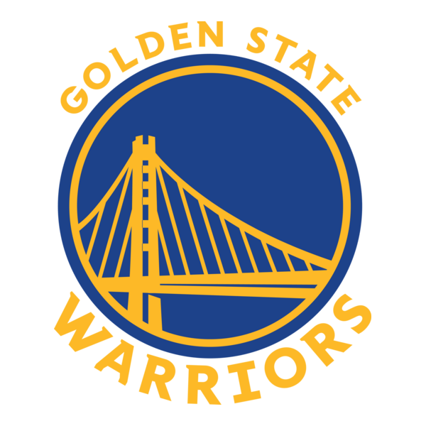
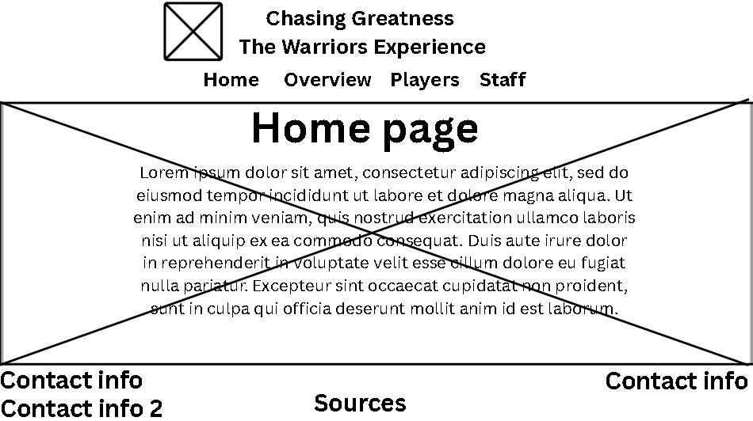
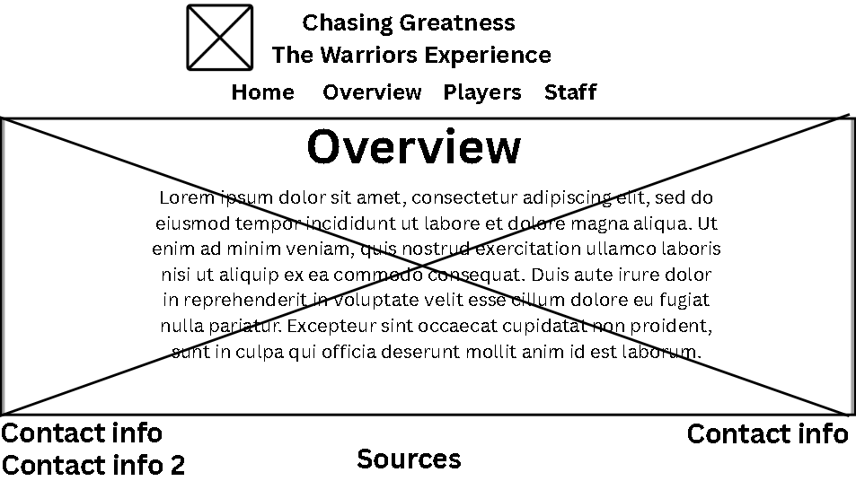

# Cabanero Marqueses Project Proposal

## 2nd quarter website design project Cabanero Marqueses Project Proposal Chasing Greatness: The Warriors Experience

### 🏀logo:

--- 

###  Description
#### This website is made for the NBA Team: Golden State Warriors. It aims to talk about the history of the team, their awards, the hall of famers, the current teams roster and positions of ever player as of 2025 explaining their goals and challenges faced, as well as their current staff. To us this is a team who has made a big effort to get to where they are in the leauge right now and we want to show readers the struggles, the memories, and the chemistry they built and how theres a lot more to being a team than just playing the sport and shooting a ball.
 
---
### Website breakdown

#### Home Page: This page will contain a simple menu/list which allows users to link and visit the other subpages on the Warriors

#### P1 Overview: This page wll contain things like an intro to the team, how it started, achievements, and the famous known plays that came from this team.

#### P2 Player list: This page will show the current roster for the GSW in the 2025-2026 NBA season. This page will also have a short description like name, age, and position they play on the court.

#### P3 Staff list: This page will show the staff list of the GSW including coaching staff, executives, and basketball operations personnel. This will also have a short description on each staff including name, age, and position.

#### P4 Community: This page wll contain things the fanbase, culture, cheers, and memories the community have made with the GSW team.

#### P5 Game Day: This page discusses on how the team prepares for every game, the struggle, the challenges and the plans they make in order to make the best out of each game and reach their goals, as well as how they build their chemistry. This will basically show the overall procedure the team goes through to get ready every season

####  Sources page: This page will show the sources we used to create the website to show people that our website has no false information. Sources will be credited in APA 7th edition.
---
Other notes:

- All links will be placed on the top under the title of each page except sources which is placed at the bottom center of each page.

- The bottom left will contain information/social pages of the Golden State Warriors Team and where you can find more information about the team itself

---
### Mock-up:

#### Home Page: 

#### First Page: 

#### Sources:

